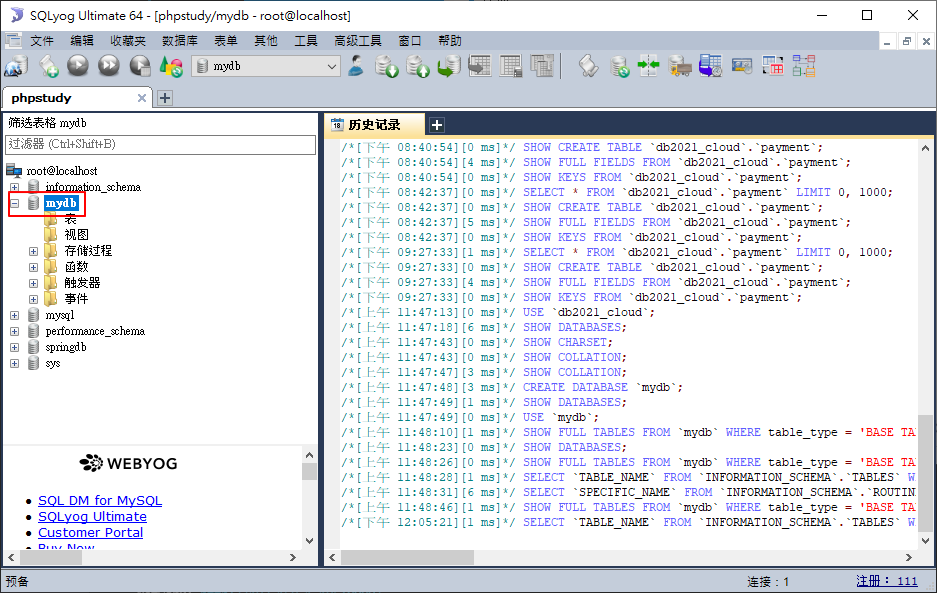
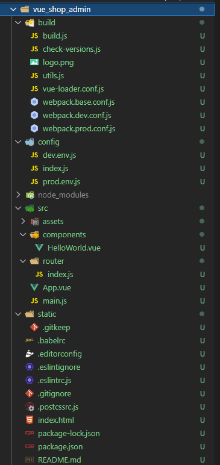
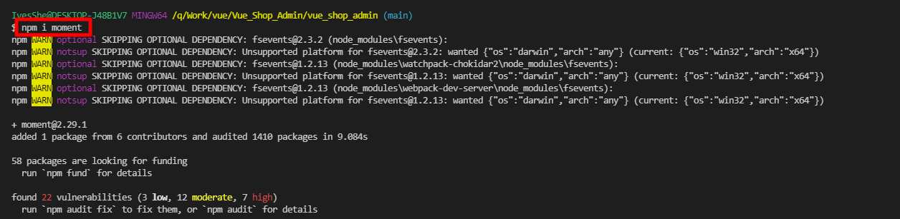

# Vue 電商後台

電商後台建構

搭配ElementUI

(開發中)


# 前置工作

這是一個前後端的完整項目

前端使用Vue開發

後端使用node.js開發

這邊先關注在Vue開發的部分

後端的部分有時間再開專案建立學習資料

## 使用mysql

先使用phpstudy開啟mysql

(這玩意真的很方便，但儘限學習使用)


## 使用sqlyog

連接mysql並創建mydb數據庫


## 執行sql


## 啟動node服務器

```
node app.js
```


# 新建專案

詳細內容可參考之前文檔

https://github.com/IvesShe/Vue_SuperMall


```bash
vue init webpack vue_shop_admin
```


創建完成的項目結構



運行

```bash
npm run dev
```


# 新增eslint --fix

package.json


增加這行

```json
"scripts": {
    "lintfix": "eslint --ext .js,.vue src --fix",
  },
```

若eslint有報錯，可以執行

```bash
npm run lintfix
```

作自動修復

# 新增--open

增加這行，執行npm run dev時會自動打開瀏覽器

```json
"scripts": {
    "dev": "webpack-dev-server --inline --progress --config build/webpack.dev.conf.js --open",
  },
```

# 如果要關閉eslint

註解掉這行即可

build/webpack.base.conf.js

```js
module: {
    rules: [
      //...(config.dev.useEslint ? [createLintingRule()] : []),      
    ]
  },
```

# ElementUI官網

https://element.eleme.cn/#/zh-CN


## 安裝

按照官網教學安裝並引用

```bash
npm i element-ui -S
```


## main.js

vue_shop_admin\src\main.js

```js
import ElementUI from 'element-ui'
import 'element-ui/lib/theme-chalk/index.css'

Vue.use(ElementUI)
```

# 新增reset.css

vue_shop_admin\src\assets\css\reset.css

```css
html,
body {
    height: 100%;
    padding: 0;
    margin: 0;
}
```

## main.js引入

vue_shop_admin\src\main.js

```js
import '@/assets/css/reset.css'
```

# axios

安裝axios

```
npm i axios
```


## 參考官網插件的部分

https://cn.vuejs.org/v2/guide/plugins.html#ad


## http.js

vue_shop_admin\src\plugins\http.js

```js
import axios from 'axios'

const MyHttpServer = {}

MyHttpServer.install = (Vue) => {
  axios.defaults.baseURL = 'http://127.0.0.1:8888/api/private/v1/'
  Vue.prototype.$http = axios
}

export default MyHttpServer

```

## main.js

vue_shop_admin\src\main.js

```js
import MyHttpServer from '@/plugins/http.js'

Vue.use(MyHttpServer)
```

# Login模塊

## Login.vue
vue_shop_admin\src\components\login\Login.vue

```js
<template>
  <div class="login-wrap">
    <el-form
    class="login-form"
    label-position="top"
    label-width="80px"
    :model="formdata">
      <h2>用戶登入</h2>
      <el-form-item label="用戶名">
        <el-input v-model="formdata.username"></el-input>
      </el-form-item>
      <el-form-item label="密碼">
        <el-input v-model="formdata.password"></el-input>
      </el-form-item>
      <el-button 
      @click.prevent="handleLogin()"
      class="login-btn" type="primary">登入</el-button>
    </el-form>
  </div>
</template>

<script>
export default {
  data () {
    return {
      formdata: {
        username: '',
        password: ''
      }
    }
  },
  methods: {
    async handleLogin () {
      const res = await this.$http.post('login', this.formdata);
    	console.log(res)
		const {
			data,
			meta: {msg,status}
		} = res.data

		if(status == 200){
			this.$router.push({name:'home'})
			this.$message.success(msg)
		}else{
			this.$message.error(msg)
		}
	}
  }
}

</script>

<style>
.login-wrap {
  height: 100%;
  background-color: #324152;
  display: flex;
  justify-content: center;
  align-items: center;
}

.login-wrap .login-form {
  width: 400px;
  background-color: #fff;
  border-radius: 5px;
  padding: 30px;
}

.login-wrap .login-btn {
  width: 100%;
}
</style>

```

## index.js

vue_shop_admin\src\router\index.js

```js
import Vue from 'vue'
import Router from 'vue-router'
import Login from '@/components/login/Login'
import Home from '@/components/home/Home'

Vue.use(Router)

export default new Router({
  routes: [
    {
      path: '/login',
      name: 'login',
      component: Login
    },
    {
      path: '/home',
      name: 'home',
      component: Home
    },
  ]
})
```

## Home.vue

vue_shop_admin\src\components\home\Home.vue

```js
<template>
  <div>home</div>
</template>

<script>
export default {

}
</script>

<style>

</style>
```

## Login模塊 運行畫面


錯誤提示


輸入正確，轉向home模塊


服務器回傳的信息


# 更換一下favicon.ico

在static目錄放入要更新的favicon.ico

vue_shop_admin\static\favicon.ico


在index.html加入此行

```js
<link rel ="shortcut icon" type="image/x-icon" href="static/favicon.ico">
```


更新成功


# 安裝vue-format


# Home模塊

相關組件

Container 布局容器

https://element.eleme.cn/#/zh-CN/component/container

Layout 布局

https://element.eleme.cn/#/zh-CN/component/layout

NavMenu 导航菜单

https://element.eleme.cn/#/zh-CN/component/menu#menu-group-attribute

Icon 图标

https://element.eleme.cn/#/zh-CN/component/icon#tu-biao-ji-he

## index.js

vue_shop_admin\src\router\index.js

```js
export default new Router({
  routes: [
    {
      path: '/',
      name: 'home',
      component: Home
    },
    {
      path: '/login',
      name: 'login',
      component: Login
    },
    {
      path: '/home',
      name: 'home',
      component: Home
    },
  ]
})
```

## Home.vue

vue_shop_admin\src\components\home\Home.vue

```js
<template>
<el-container class="container">
    <el-header class="header">
        <el-row>
            <el-col :span="4" class="left">
                <div class="grid-content bg-purple">
                    
                </div>
            </el-col>
            <el-col :span="18" class="middle">
                <div class="grid-content bg-purple-light">
                    <h3>電商後台管理系統</h3>
                </div>
            </el-col>
            <el-col :span="2">
                <div class="grid-content bg-purple">
                    <a class="loginout" @click.prevent="handleSingout" href="#">退出</a>
                </div>
            </el-col>
        </el-row>
    </el-header>
    <el-container>
        <el-aside class="aside" width="200px">
            <el-menu
            :unique-opened="true"
            >
                <el-submenu index="1">
                    <template slot="title">
                        <i class="el-icon-location"></i>
                        <span>用戶管理</span>
                    </template>
                    <el-menu-item index="1-1">
                        <i class="el-icon-success"></i>
                        <span>用戶列表</span>
                    </el-menu-item>
                </el-submenu>
                <el-submenu index="2">
                    <template slot="title">
                        <i class="el-icon-location"></i>
                        <span>權限管理</span>
                    </template>
                    <el-menu-item index="1-1">
                        <i class="el-icon-location"></i>
                        <span>角色列表</span>
                    </el-menu-item>
                    <el-menu-item index="1-1">
                        <i class="el-icon-location"></i>
                        <span>權限列表</span>
                    </el-menu-item>
                </el-submenu>
                <el-submenu index="3">
                    <template slot="title">
                        <i class="el-icon-location"></i>
                        <span>商品管理</span>
                    </template>
                    <el-menu-item index="1-1">
                        <i class="el-icon-location"></i>
                        <span>商品列表</span>
                    </el-menu-item>
                    <el-menu-item index="1-1">
                        <i class="el-icon-location"></i>
                        <span>分類參數</span>
                    </el-menu-item>
                    <el-menu-item index="1-1">
                        <i class="el-icon-location"></i>
                        <span>商品分類</span>
                    </el-menu-item>
                </el-submenu>
                <el-submenu index="4">
                    <template slot="title">
                        <i class="el-icon-location"></i>
                        <span>訂單管理</span>
                    </template>
                    <el-menu-item index="1-1">
                        <i class="el-icon-location"></i>
                        <span>选项1</span>
                    </el-menu-item>
                </el-submenu>
                <el-submenu index="5">
                    <template slot="title">
                        <i class="el-icon-location"></i>
                        <span>數據統計</span>
                    </template>
                    <el-menu-item index="1-1">
                        <i class="el-icon-location"></i>
                        <span>选项1</span>
                    </el-menu-item>
                </el-submenu>

            </el-menu>
        </el-aside>
        <el-main class="main">Main</el-main>
    </el-container>
</el-container>
</template>

<script>
export default {
  
  beforeCreate() {
    const token = localStorage.getItem('token')

    if(!token){
      this.$router.push({name:'login'})
    }
  },

  methods: {
    handleSingout() {
      localStorage.clear()
      this.$message.success('退出成功')
      this.$router.push({name:'login'})
    }
  },
}
</script>

<style>
.container {
    height: 100%;
}

.header {
    background-color: #b3c0d1;
}

.aside {
    background-color: #d3dce6;
}

.main {
    background-color: #e9eef3;
}

.left img {
    height: 60px;
}

.middle {
    text-align: center;
}

.loginout {
    text-decoration: none;
    line-height: 60px;
}
</style>

```


## Home模塊 運行畫面


# 用戶管理模塊 Users.vue

相關組件

Card 卡片

https://element.eleme.cn/#/zh-CN/component/card#attributes

Breadcrumb 面包屑

https://element.eleme.cn/#/zh-CN/component/breadcrumb#breadcrumb-mian-bao-xie


Input 输入框

https://element.eleme.cn/#/zh-CN/component/input


Button 按钮

https://element.eleme.cn/#/zh-CN/component/button#bu-tong-chi-cun

Table 表格

https://element.eleme.cn/#/zh-CN/component/table#table-column-scoped-slot


Switch 开关

https://element.eleme.cn/#/zh-CN/component/switch#methods

Pagination 分页

https://element.eleme.cn/#/zh-CN/component/pagination#events

axios中文說明

https://www.kancloud.cn/yunye/axios/234845

## 安裝moment

```bash
npm i moment
```



## 用戶列表 完成畫面


